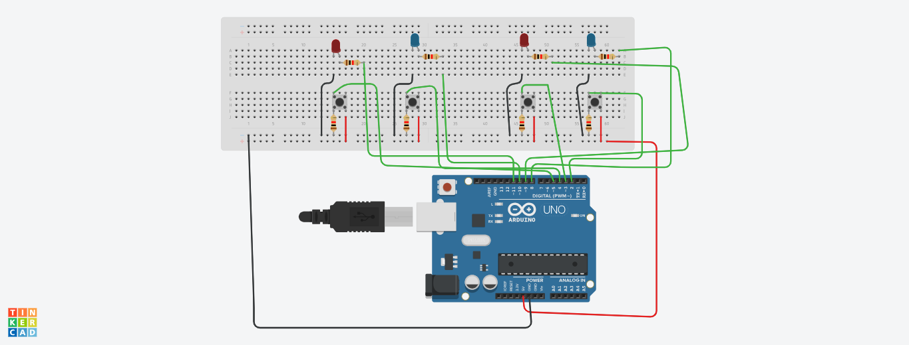
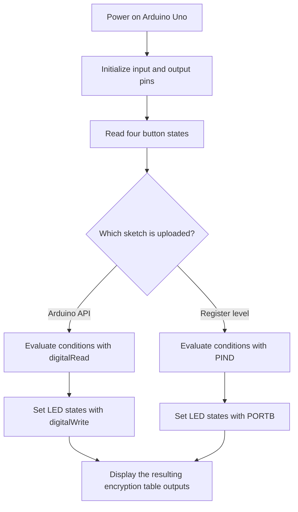

<p align="center">
	
</p>

<h1 align="center">Encryption Table using Arduino Uno</h1>

<p align="center"><i>An Arduino Uno R3 project that implements the same four-input, four-output logic table using both Arduino helper functions and direct register-level programming.</i></p>

<p align="center">
	
	
	
	
</p>

## Table of Contents

- [🚀 Project intro](#-project-intro)
- [📁 Project structure](#-project-structure)
- [⭐ Differentiators](#-differentiators)
- [🔧 Features](#-features)
  - [Flow diagram](#flow-diagram)
  - [Hardware mapping](#hardware-mapping)
- [🧰 Tech stack](#-tech-stack)
- [⚙️ Install methods](#️-install-methods)
- [🔐 Hardware configuration](#-hardware-configuration)
- [🗄️ Hardware layout](#hardware-layout)
- [🚀 Wiring and upload notes](#-wiring-and-upload-notes)
- [🤝 Contributing](#-contributing)
- [📄 License](#-license)

## 🚀 Project intro

This project implements an encryption table on an Arduino Uno R3 using two different coding styles:

- One sketch uses standard Arduino functions such as `pinMode()`, `digitalRead()`, and `digitalWrite()`.
- The other sketch uses direct register manipulation with `DDRD`, `DDRB`, `PIND`, and `PORTB`.

Both versions read four push buttons and drive four LEDs according to the same logic conditions, which makes the repository useful for comparing Arduino-level and low-level AVR-style implementation approaches.

## 📁 Project structure

```txt
Encryption-Table-using-Arduino-Uno/
├── Arduino-Uno-Pin-Diagram.png
├── Setup.png
├── CSE331ProjectV2.ino
├── CSE331ProjectV2ResisterFinal.ino
├── LICENSE
└── README.md
```

The two `.ino` files represent the two implementation styles used in the project, while the images document the board pinout and the physical wiring setup.

## ⭐ Differentiators

- Two complete implementations of the same logic table are included in the same repository.
- The Arduino API version is easier to read and adapt for beginners.
- The register-level version shows how to control the Uno at the port and bit level.
- The repository includes wiring visuals to help reproduce the circuit on a breadboard.
- The project does not rely on any external libraries.

## 🔧 Features

### Core features

| Feature | Status | Notes |
| --- | --- | --- |
| Four-button input handling | Implemented | The sketch reads four digital inputs from the Arduino Uno. |
| Four-LED output control | Implemented | Each output condition drives one LED on the circuit. |
| Arduino API implementation | Implemented | Uses `pinMode()`, `digitalRead()`, and `digitalWrite()`. |
| Register-level implementation | Implemented | Uses direct access to `DDRD`, `DDRB`, `PIND`, and `PORTB`. |
| Breadboard wiring reference | Implemented | The repository includes setup images for the physical circuit. |

### Flow diagram

The Mermaid flow below shows the main execution path used by both sketches.



### Hardware mapping

The project uses the following pin assignments:

- Inputs: D2, D3, D4, and D5
- Outputs: D8, D9, D10, and D11

In the register-level sketch, those pins map to:

- Inputs on `PIND` bits 2 through 5
- Outputs on `PORTB` bits 0 through 3

## 🧰 Tech stack

- **Platform:** Arduino Uno R3
- **Language:** Arduino C/C++
- **Programming styles:** Arduino helper functions and direct AVR register access
- **Hardware:** Breadboard, four push buttons, four LEDs, resistors, jumper wires, USB cable
- **Documentation assets:** Pin diagram and setup image included in the repository

## ⚙️ Install methods

### Arduino IDE

Prerequisites:

- Arduino Uno R3
- USB cable
- Arduino IDE or another compatible Arduino editor
- Breadboard components shown in the setup image

1. Open either `CSE331ProjectV2.ino` or `CSE331ProjectV2ResisterFinal.ino` in the Arduino IDE.
2. Wire the circuit according to `Setup.png` and `Arduino-Uno-Pin-Diagram.png`.
3. Select **Arduino Uno** as the board.
4. Select the correct serial port for your board.
5. Upload the sketch.
6. Press the buttons and observe the LED outputs.

If you want to compare both approaches, upload one sketch at a time and switch between them after each build.

## 🔐 Hardware configuration

This project does not use software environment variables. The important configuration is the physical circuit itself:

- The button inputs are configured as standard input pins, so the wiring must provide stable logic levels.
- The LED outputs are connected to the output pins listed above.
- The register-level sketch expects the same board wiring as the Arduino API sketch.

## 🗄️ Hardware layout

Reference assets in the repository:

- [Arduino Uno pin diagram](./Arduino-Uno-Pin-Diagram.png)
- [Breadboard setup image](./Setup.png)

Sketch mapping summary:

| Role | Arduino pins | Register-level mapping |
| --- | --- | --- |
| Input 0 | D2 | PD2 |
| Input 1 | D3 | PD3 |
| Input 2 | D4 | PD4 |
| Input 3 | D5 | PD5 |
| Output 0 | D8 | PB0 |
| Output 1 | D9 | PB1 |
| Output 2 | D10 | PB2 |
| Output 3 | D11 | PB3 |

## 🚀 Wiring and upload notes

- Keep the wiring consistent with the provided setup image so the button states are read correctly.
- The direct-register sketch writes to `PORTB`, so any hardware changes should preserve the same output pin layout.
- If you change the pin assignments, update both `.ino` files so the two implementations stay aligned.
- The project is intended for an Arduino Uno R3 and should be uploaded with that board selected in the IDE.

## 🤝 Contributing

- Fork the repository and create a feature branch.
- Keep changes focused and verify the sketch still uploads successfully.
- Avoid committing generated binaries or local board settings.

## 📄 License

This project is licensed under the MIT License. See the [LICENSE](./LICENSE) file for details.
